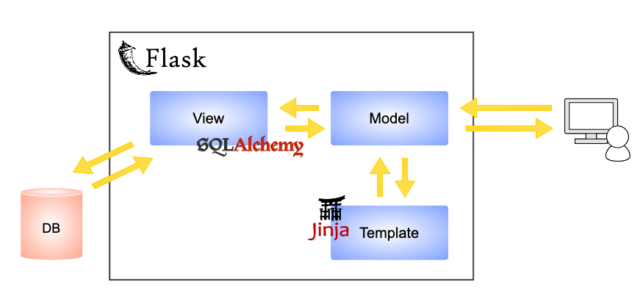
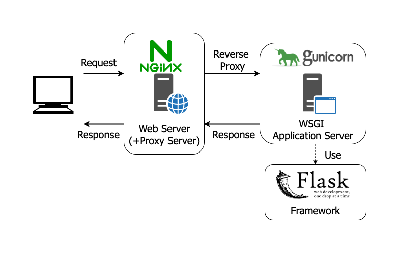

# Rendkívüli Ügyek Minisztériuma

---
<!-- TOC start -->
## Tartalomjegyzék
- [Rendkívüli Ügyek Minisztériuma](#rendkívüli-ügyek-minisztériuma)
   * [Specifikáció](#specifikáció)
   * [Az applikáció általános magas szintű leírása  ](#az-applikáció-általános-magas-szintű-leírása)
      + [1. Kezdőlap  ](#1-kezdőlap)
      + [2. Bejelentés  ](#2-bejelentés)
      + [3. Ügy adatlap](#3-ügy-adatlap)
      + [4. Összes bejelentés](#4-összes-bejelentés)
      + [5. Térkép](#5-térkép)
      + [6. Statisztika](#6-statisztika)
      + [7. Regisztráció](#7-regisztráció)
      + [TODO](#todo)
      + [8. Bejelentkezés  ](#8-bejelentkezés)
      + [TODO](#todo-1)
      + [9. Fiókbeállítások](#9-fiókbeállítások)
      + [10. Felhasználói adatok módosítása](#10-felhasználói-adatok-módosítása)
      + [11. Felhasználók](#11-felhasználók)
      + [12. Ügy adatainak módosítása](#12-ügy-adatainak-módosítása)
      + [13. Szervező hozzáadása](#13-szervező-hozzáadása)
      + [14. Easter Egg](#14-easter-egg)
   * [Szoftver architektúra](#szoftver-architektúra)
      + [Az applikáció szerkezeti áttekintése](#az-applikáció-szerkezeti-áttekintése)
      + [További 3rd party modulok](#további-3rd-party-modulok)
      + [Adatbázis leírása](#adatbázis-leírása)
      + [Funkcionalitások leírása](#funkcionalitások-leírása)
      + [3rd party szoftverek integráltsága](#3rd-party-szoftverek-integráltsága)
   * [Jogosulstágkezelés](#jogosulstágkezelés)
   * [Spam Botok elleni védelem](#spam-botok-elleni-védelem)
   * [GDPR](#gdpr)
   * [Sütik](#sütik)
   * [Adatkezelési szabályzat  ](#adatkezelési-szabályzat)
   * [Hibaelhárítás](#hibaelhárítás)
   * [Monitoring](#monitoring)
   * [Gyakran Ismételt Kérdések](#gyakran-ismételt-kérdések)
<!-- TOC end -->
<!-- TOC -->
---

## Specifikáció

A Rendkívüli Ügyek Minisztériuma webes alkalmazás a következő funkciókat teszi lehetővé:  

* Közterületen található elhanyagolt állapotú tárgyakról szóló bejelentés felvétele és gyűjtése az adatbázisba.  
* Bejelentések adminisztrációja. (státuszok közti váltás, szervező hozzáadása, képek hozzáadása utólagosan)  
* Bejelentések körüli kommunikáció lehetővé tétele.(levelek, kommentek, elérhetőségek)  
* Bejelentések megjelenítése (kártyaként és térképen)  

## Az applikáció általános magas szintű leírása  

A Rendkívüli Ügyek Minisztériuma tartalmazza a következő oldalakat:  
1. Kezdőlap  
2. Bejelentés  
3. Ügy adatlap  
4. Összes bejelentés  
5. Térkép  
6. Statisztikák  
7. Regisztráció  
8. Bejelentkezés / Kijelentkezés  
  
### 1. Kezdőlap  
  
A kezdőlapot minden felhasználói jogosultság eléri.  
A kezdőlapon a következő leírás szerepel:  
> Üdv az MKKP városmódosító oldalán!  
> Benőtte a gaz a szétrúgott elektromos szekrényt?  
> Kátyúba dőlt az összegrefitizett villanyoszlop?  
> Nem látszik a szeméttől a lekopott zebra, amin amúgy se lehetne átkelni kerekesszékkel?  
> Jelentsd be a térképen a problémákat, amiket a városodban látsz és mi megoldjuk!  
> Vagy legalább viccessé tesszük.  
> Vagy legalább széppé.  
> A bejelentések alatt kommentben várjuk az ötleteket, hogy mit kezdjünk az adott problémával.  
> Ha bármi kérdésed van az oldallal kapcsolatban, esetleg kezdtél valamit az egyik bejelentéssel,  
> írj nekünk a ketfarkukutya@gmail.com-ra!  

### 2. Bejelentés  

A bejelentés oldalt minden felhasználói jogosultság eléri.  
A bejelentés oldalon a felhasználó városfelújítós probléma bejelentést tud tenni.  
A felület célja az ügy adatainak és az ügyhöz csatolt képek felvétele az adatbázisba.  
Kötelezően kitöltendő mezők:  
- Probléma megnevezése (szabad szöveges mező)
- Típus (legördülő menü)
  - Szemét
  - Közmű
  - Út és Járda
  - Akadálymentesítés
  - Növény
  - Állat
  - Épület
  - Közlekedés
  - Tájékoztatás
  - Műemlék

-	Részletes leírás (szabad szöveges mező)    
-	Képek feltöltése (file dialógus menü)    
Ha a felhasználó kiválasztja a képeket, megjelenik még egy opcionálisan használatba vehető  
file feltöltési mező, ahol a felhasználó további képeket adhat a bejelentéshez.
-	Email cím (szabad szöveges mező)  
-	Adatkezelési szabályzat elfogadása (bepipálható mező)  
-	Cím (szabad szöveges mező)  
  
**Opcionális mezők:**  
-	Megoldási javaslat (szabad szöveges mező)  
-	Telefon (szabad szöveges mező)  
A bejelentés oldalon a felhasználó képeket is tud feltölteni.    
A helyszín megadásánál a felhasználó egy gomb segítségével le tudja ellenőrizni / kiegészíteni az általa begépelt helyszín címet.  
A cím megadását egy térkép segíti, amire ha a felhasználó rákattint, akkor a cím automatikusan kitöltődik.  
  
Mobilon a cím megadását a helyhozzáférés segíti.   
Ha a felhasználó készülékén a helymeghatározás be van kapcsolva, akkor helyszín adatok automatikusan kitöltésre kerülnek.  
Ha a felhasználó készülékén a helymeghatározás ki van kapcsolva, akkor a következő üzenetet kapja:  
*“Ajjaj... A helyhozzáférés nincsen engedélyezve. Ha szeretnéd, hogy robokutyi töltse ki helyetted a címet, akkor kérlek engedélyezd.”  
Ha a felhasználó ekkor engedélyezi a helyhozzáférést és frissíti az oldalt, akkor helyszín adatok automatikusan kitöltésre kerülnek.*

A térképen található egy kereső mező, amit szintén lehet használni a cím megadásakor.  
A térképen szerepelnek navigációs ikonok.  
A térképet ki lehet nagyítani teljes méretűre. 

A Bejelent gombra kattintva, a kötelező mezőkre lefut egy űrlap ellenőrzés. 
Ha egy kötelező mező kitöltetlenül maradt, akkor a következő hibaüzenetek válnak láthatóvá az űrlapon, 
aszerint hogy melyik mezőt nem töltötték ki:  
-	Probléma megnevezése: Ha nem tudod megnevezni, akkor az nem probléma.  
-	Típus: Tök széles a választék, bökj rá egyre!  
-	Részletes leírás: Nem baj, ha nem töltöd ki. Tényleg. Csináld csak! Semmi baj. Nem haragszunk. Azt csinálsz, amit akarsz.  
-	Képek feltöltése: Ellopták a képfájlt. Próbáld újra!  
-	Email cím: A PIN-kódod jól jönne, de inkább írd be ide a mailed.  
-	Adatkezelési szabályzat elfogadása: Haladjunk, kérem, haladjunk.  
-	Cím: Sajnos pontosan meg kell mondanod, hogy hol van mi, merre, miként.
 
A program a háttérben végez egy email ellenőrzést, és megszakítja a bejelentést ha:  
- szintaktikailag hibás az email cím pl nincs benne @ karakter (Hibaüzenet: A Kutya mindenit de fura ez az email cím!)  
- a cím mezőben “http” karakterláncot talál.  
- nem engedélyezett file formátumokat talál (engedélyezett: png, jpeg)

Ha az űrlap ellenőrzés nem talál kitöltetlen kötelező mezőt, akkor elkezdi az adatok és képek feltöltését az adatbázisba.   
Töltés közben egy gif és egy felirat (Türelem, már dolgozunk rajta!) tájékoztatja a felhasználót arról, hogy a rendszer munkát végez.  
Ha sikeres a bejelentés, rendszerüzenetet kap a felhasználó:   
*Gratulálunk, sikeres bejelentés. Küldtünk levelet is.*  

Ha sikeres a feltöltés, a felhasználó által megadott email címre level megy:   

*Szia!  
Köszi, hogy jelezted nekünk az alábbi problémát: valami4642  
4000 mérnökünk és 3600 menyétünk elkezdett dolgozni rajta.    
Hamarosan megoldjuk, vagy nem.  
Keresünk majd, amint kitaláltuk, hogy mit csináljunk a dologgal.  
Addig is itt tudod nyomonkövetni, hogyan állunk vele: https://rendkivuliugyek.com/single_submission/1  
Rendkívüli Ügyek Minisztériuma*  

Ha sikeres a feltöltés, a bejelentés oldal az ügy adatlapjára továbbítja a bejelentő böngészőjét.  

### 3. Ügy adatlap
Az ügy adatlapja minden jogosultsági szintnek elérhető, viszont a felhasználók a különböző jogosultsági szintektől függően más-más honlap elemeket látnak.  
A **regisztrálatlan felhasználó** jogosultági szint a következő elemeket látja az adatlapon:  
- Borítókép  
- A borítóképre rá lehet kattintani, ekkor megjelenik a bejelentés összes képét (borítókép-előtte-utána) tartalmazó galéria.  
- A borítókép teljes felbontásban jelenik meg.  

Ügy Adatlap:  
- Ha az ügy kiemelt ügy, akkor ez az információ megjelenik az adatlap első sorában  
- Leírás  
- Státusz  
- Ebben a státuszban  
- Típus  
- Bejelentve  
- Megye  
- Cím  
- Zárószöveg (csak akkor ha megoldott sátuszú az ügy és kitöltötték ezt a mezőt)

Ha az ügy nem megoldott, akkor megjelenik a következő kapcsolat információ:  
Ha szeretnél részt venni a felújításban, írj nekünk a rendkivuliugyek@mkkp.hu-ra!  
Facebook Share gomb amely megjeleníti az eddigi megosztások számát.  
A facebook megosztásra kattintva a megosztás képe a mindenkori borítókép lesz.  
Ha az ügy nem befejezett, akkor a facebook megosztás szövege a részletes leírás szövege.  
Ha az ügy befejezett, és ki van töltve a zárószöveg mező, akkor a facebook megosztás szövege a zárószöveg szövegével egyezik meg.

- Előtte képek (ha vannak)  
- Ha csak egy kép van, akkor az borítóképként jelenik meg, tehát az előtte képek szekcióban nem jelenik meg.
- Utána képek (ha vannak)
- Térkép

A **regisztrált felhasználó** jogosultsági szint a következő elemeket látja az adatlapon:
- Örökli a regisztrálatlan felhasználó elemeit
- Komment szekció, ahol kommenteket adhat az adatlapphoz, módosíthatja és törölheti azokat. 
  A kommenteknél a felhasználó neve és a komment hozzáadásának dátuma szerepel.
  
A **szervező felhasználó** jogosultsági szint a következő elemeket látja az adatlapon:  
- Örökli a regisztrált felhasználó elemeit
- Adatlap módosítása gomb
- Előtte képek feltöltése
- Utána képek feltöltése
Fontos, hogy az ügyhöz adott szervező, csak az adott ügynél rendelkezik a fentebbi jogokkal. 
	Más ügyeknél a jogosultsági szintje a rendes jogosultsági szintjével egyezik meg.
	
A **regisztrált felhasználó, aki ha bejelentő is** egyben
- Örökli a szervező felhasználó elemeit
Fontos, hogy a regisztrált bejelentő, **csak az adott ügynél** rendelkezik a fentebb jogokkal. 
	Más ügyeknél a jogosultsági szintje a rendes jogosultsági szintjével egyezik meg.
	
A **koordinátor felhasználó** jogosultsági szint a következő elemeket látja az adatlapon:
- Örökli a szervező felhasználó elemeit
	Fontos, hogy a koordinátor felhasználó nem csak egy adott ügynél rendelkezik a 
	fentebb leírt jogosultságokkal, hanem az **összes ügynél**.
	
Az **admin** felhasználó jogosultsági szint a következő elemeket látja az adatlapon:
- Örökli a koordinátor felhasználó elemeit
- Ügy törlése gomb
- Mások kommentjeinek szerkesztése és törlése

### 4. Összes bejelentés
Az összes bejelentés minden jogosultsági szintnek elérhető.   
A különböző jogosultsági szintek között nincsen eltérés; mindenki ugyanazt látja.  
Oldalelemek:  
- Részletes keresés gomb. A gombra kattintva lenyílik egy menü, ahol különböző szűkítéseket lehet megadni:
  - Státusz
  - Típus
  - Megye
  Amennyiben a Megye részbe Budapest-et ad meg a felhasználó, akkor megjelenik egy további legördülő menü, 
  ami a Budapesten belüli kerület választást teszi lehetővé.
- Szöveges keresés 
A szöveges keresés minden státuszban típusban és megyében keres és független az összes többi szűkítési beállítástól.  

A részletes keresés alatt az egyes ügyek kártyái látszódnak. Egy kártya felépítése a következő:  
- Fejléc: Típus piktogram, Típus megnevezés
- Borítókép 
- Bejelentés megnevezése
- Város
- Bejelentés leírása (csak az első mondat)  
	Az összes bejelentés közül egyszerre csak N darab jelenik meg. 
	A honlap alján paginációs menü található.
	
### 5. Térkép
A térkép minden jogosultsági szintnek elérhető.  
A különböző jogosultsági szintek között nincsen eltérés; mindenki ugyanazt látja.  
Oldalelemek:  
- Részletes keresés gomb. A gombra kattintva lenyílik egy menü, ahol különböző szűkítéseket lehet megadni:	
- Típus
- Státusz
- Térkép 
A térképen az egyes ügyek típus ikonokként jelennek meg. 
Az ikonra kattintva egy új ablak ugrik fel, a következő felépítéssel:
- Ügy neve
- Ügy típusa 
- Ügy státusza
- Ügy borító képe. A képre kattintva átkerülünk az ügy adatlapjára.
- Jelmagyarázat
  A jelmagyarázat mobilon más arányt vesz fel, hogy olvasható maradjon, 
  tehát két külön kép van beállítva.
  
### 6. Statisztika
A statisztika oldal minden jogosultsági szintnek elérhető.  
A különböző jogosultsági szintek között nincsen eltérés. Mindenki ugyanazt látja.
Az adminisztrátori statisztikához lásd: 6. Monitoring fejezet.  

Oldalelemek:
- Bejelentések megoszlása státusz szerint oszlopdiagram
- Bejelentések megoszlása megye szerint oszlopdiagram
- További hasznos statisztikák lista
- Kényelmetlen fehérneműk száma a Parlamentben: 199
- Összes statisztika az oldalon: 11.5
- Főispánok száma Magyarországon: 19
- Összes bejelentés a honlapon: *A*
- Összes bolygó száma a Naprendszerben: 8
- Összes regisztrált felhasználó: *B*
- Magyarországon található települések száma: 3155
- Ételautomaták által évente megölt emberek száma átlagosan a világon: 10  
  Az A és B jelű elemek valós dinamikus változók, az összes többi pont statikus érték.

### 7. Regisztráció
# TODO

### 8. Bejelentkezés  
# TODO

### 9. Fiókbeállítások
A fiókbeállítás menüpontot csak a regisztrált felhasználó látja.  
Oldalelemek:  
- Felhasználónév  
- Email cím  
- Telefon szám  
- Létrehozva  
- Felhasználói szint  
- Adatok módosítása gomb  
A gombra kattintva megjelenik az adatmódosító felület.  
Az adatmódosító felületen a következő módosítások végezhetőek:  
  - Felhasználónév módosítása  
  - Email módosítása  
  - Telefonszám módosítása  

- Ügyeim listája gomb
A gombra kattintva két lista jelenik meg.
  - Általam bejelentve lista.  
  Ez minden olyan ügy, amit a felhasználó jelentett be.

  - Szervező vagyok lista.  
  Ez minden olyan ügy, ahol a felhasználó szervezőként lett hozzáadva az ügyhöz.

- Dokumentáció és egyéb anyagok link
- Github oldal link
- Monitorozó oldal link
- Adatkezelési szabályzat link

Admin  jogosultsági szint elér egy további oldal elemet:
- Összes ügy letöltése egy csv-ben. 
A gombra kattintva elkezdődik az összes ügy exportálása és letöltése CSV (“,”) formátumban. Windows alatt lehet hogy beolvasásakor be kell állítani, hogy UTF-8 karakterkészlettel értelmezze a szöveget. 
Windows alatt lehet hogy nem elég simán dupla klikkel megnyitni, hanem 
Adatok > Szövegből > UTF-8
A néni 1:12-től nagyon szépen elmagyarázza: https://www.youtube.com/watch?v=ZbljSnxoNLo
A csv a következő mezőket tartalmazza:
- ID
- Bejelentő email	
- Bejelentő telefon	
- Cím	
- Elnevezés	
- Hosszúsági fok	
- Kiemelt	Leírás	
- Létrehozva	
- Megoldás	
- Megoldási javaslat	
- Megye	
- Státusz	
- Státusz változás dátuma
- Státuszt változtató felhasználó	
- Szervező email	Szervező felhasználó	
- Szélességi fok	
- Típus	
- Város
Figyelem, ez a táblázat tartalmazza a bejelentő email címét és esetlegesen a telefonszámát is,
	vagyis a GDPR szerinti személyes adatokat! Regisztrálatlan és regisztrált (nem szervező, 
	nem koordinátor és nem admin) felhasználók számára ezek az adatok  a honlapon belül sehol nem
	jelennek meg.
	
### 10. Felhasználói adatok módosítása
A Felhasználói adatok módosítása oldalt a regisztrált felhasználó látja.  
A következő adatokat tudja módosítani a felhasználó:  
- Felhasználónév
- Email
- Telefonszám

### 11. Felhasználók
A Felhasználók oldalt az csak admin jogosultsági szint éri el.  
Oldalelemek:
- Email alapú keresési mező. A keresés nem közöl adatokat az adatbázis felé, végig a frontenden marad.
- Táblázat a következő adatokkal:
- Felhasználó
- Email
- Telefon
- Felhasználói szint
- Létrehozva
- Utoljára itt

A felhasználó nevére kattintva megjelenik a Felhasználó kezelése nevű oldal.  
A Felhasználó kezelése oldalt az csak admin jogosultsági szint éri el.  

Oldalelemek:
- Felhasználó név
- Jogosultsági szint legördülő menü. A kiválasztott jogosultsági szintet (registered / coordinator / admin)a Ment gombra kattintva lehet érvényesíteni.  
A jogosultsági szintnek nem kell átfutási idő, viszont egy kijelentkezés-bejelentkezés javasolt az új jogosultsági szinttel rendelkező felhasználó részéről.
- Email
- Telefon
- Felhasználó létrehozva
- Utolsó bejelentkezés
- Ment gomb

### 12. Ügy adatainak módosítása
Az ügy adatainak módosítását a szervező, a koordinátor és az admin jogosultsági szint éri el.

Oldalelemek:
- Státusz lenyíló menü  
  Ha a státuszt Megoldottra állítjuk, akkor megjelenik a Megoldás szabadszöveges mező. 
- Bejelentő email címe szabadszöveges mező
- Ügy megnevezése szabadszöveges mező
- Bejelentő telefonszáma szabadszöveges mező
- Ügy megnevezése szabadszöveges mező
- Ügy típusa lenyíló menü
- Ügy leírása szabadszöveges mező 
- Megoldási javaslat szabadszöveges mező
- Cím szabadszöveges mező
- Cím módosítása szabadszöveges mező
- Cím ellenőrzése gomb
- Csak az admin jogosoltságú felhasználónak elérhető oldalelem:
Kiemelt bejegyzés

### 13. Szervező hozzáadása
A rendező hozzáadása felület a koordinátor és az admin jogosultsági szinteknek elérhető.
Oldalelemek:
- Email alapú kereső
- Táblázat a következő elemekkel:
  - kijelöl (kipipálható doboz)
  - email 
  - felhasználó
  - telefon
  - Hozzáadom gomb
Egyszerre csak egy rendező adható hozzá egy bejelentéshez!

### 14. Easter Egg

01001110 11101001 01111010 01100100 00100000 01101101 01100101 01100111 00100000 01100001 01111010 00100000 01101111 01101100 01100100 01100001 01101100 01101111 01101110 00100000 00101111 01101011 01110101 01110100 01111001 01101001 00100000 01010101 01010010 01001100 00101101 01110100 00100001 
01000001 00100000 01101011 11101001 01110000 01100101 01101011 00100000 01100001 00100000 01101000 01110100 01110100 01110000 01110011 00111010 00101111 00101111 01100100 01101111 01100111 00101110 01100011 01100101 01101111 00101111 01100100 01101111 01100111 00101101 01100001 01110000 01101001 00101111 00100000 00101101 01110010 11110011 01101100 00100000 01101010 11110110 01101110 01101110 01100101 01101011 00101110 

### Szoftver architektúra
Az alábbi fejezetek tartalmazzák az alkalmazás techinkai leírását.  
A Rendkívüli Ügyek Minisztériuma specifikáció python Flask keretrendszerben lett implementálva.  
A flask adja a backend részt, míg a frontend HTML CSS és Javascript nyelven írt elemekből épül fel.  
A felhasznált python modulokat a requirements.txt tartalmazza.  
A Flask alkalmazások az MVT (Model View Template) architektúrát követik.  
  
Ez egy kicsit más, mint az ismertebb MVC (Model View Controller) architektúra.   
Mivel a Flask egy mikorkeretrendszer, ezért nem támogatja teljes egészében az MVC architektúra megvalósítását.  
Az MVT esetében a Controll részről a keretrendszer gondoskodik, amely HTTP requestre válaszként sablont (Template) küld.  
A templatek a .\templates mappában találhatóak.  
A model, vagyis az adatbázis sémák definíciója a .\models.py fileban található.  
Az adatbázis a .\app.db nevű sqlite fileban található és az alkalmazás (app.py) első indításakor keletkezik a models.py definíciói alapján.  
A View részt az .\app.py kezeli  
A lekéréseket WSGI (PEP333) specifikáció szerint kezeli a middleware.  
  
A RÜM applikáció Gunicorn alkalmazás szervert használ, amely a következő feladatokért felel:
- Több alkalmazás instanciát futtat. (A RÜM esetében a Gunicorn 4 instanciát futtat)
> Lásd Dockerfile: CMD ["-w=4", "-b", "0.0.0.0:5000", "app:app"]
- Ha leáll az alkalmazás, akkor automatikusan újraindítja az insanciát
- HTTP requesteket közvetít a webszerver és az alkalmazás között
- Terheléselosztást (load balancing) végez.

Gunicorn dokumentáció: https://docs.gunicorn.org/en/stable/

### Az applikáció szerkezeti áttekintése
A RÜM applikáció python programnyelvben íródott és alapvetőleg a Flask modulra támaszkodik.  
A Flask egy mikrokeretrendszer, ami egy minimális webalkalmazás futtatását teszi lehetővé.  
Az alap keretrendszer a következő eszközöket tartalmazza:  
- Werkzeug:  
Ez adja a WSGI interfészt. 
A RÜM esetében ezzel kommunikál a Gunicorn applikációs szerver.  
- Jinja2 templating engine:   
Ez teszi lehetővé hogy a statikus HTML vázba dinamikus változókat írjon az applikáció.   
Egy jinja template tehát képes kezelni az alkalmazás backendről kapott adatokat.

Flask dokumentáció: https://flask.palletsprojects.com/en/2.2.x/

Mivel ez egy minimális keretrendszer számos kiegészítő modulra szorul.  
Felhasznált 3rd party Flask modulok:  
- Flask-SQLAlchemy  
Adatbázis agnosztikus Object Relationship Mapper. Ez építi fel a modely.py-ban definiált adatbázist,  
illetve ez a modul biztosítja az alkalmazás kommunikációját (CRUD) az adatbázissal.  
Az SQLAlchemynek köszönhetően as SQLite adatbázis lecserélhető más relációs adatbázis rendszerekre, pl MySQL vagy Postgres.  
https://pypi.org/project/flask-sqlalchemy/

- Flask-Login  
Ez a modul kezeli a bejelentkezett felhasználókat.  
A models.py-ban definiált user tábla osztály örökli a flask._login.UserMixint. 
Az azonosítás email alapján történik.   
A regisztráció a https://passziv.mkkp.party/regisztracio auth0 passzivista felületen történik.  
Sikeres bejelentkezéskor az alkalmazás visszakapja a felhasználó email címét az Auth0 rendszertől.  
Alkalmazáson belüli inicializálás:  
> login.init_app(app)  
> login.login_view = 'login'  
Ahol a ’login’ megegyezik a /login url routtal.  
  
Az app.py alkalmazáson belül meghívott flask-login modulok:  

- login_user
A login user függvényt a  /callback url route hívja és egy érvényes SQLAlchemy user modelt fogad paraméterként.  
Az érvényes user model objektumot a következő sor adja:  
user = UserModel.query.filter_by(email = user_email).first()  
A user_email string a sikeres bejelentkezés után az auth0 API-tól érkezik.  
https://flask-login.readthedocs.io/en/latest/#flask_login.login_user  

- logout_user
A logout_user függvényt a /logout url route hívja és nincsenek megadanó paraméterei.  
A current_usert fogja kijelentkeztetni a rendkivuliugyek.com alkalmazásból.
A https://passziv.mkkp.party oldalt nem érinti ez a kijelentkeztetés.  
Ha ténylegesen ki akarunk jelentkezni, akkor a https://passziv.mkkp.party oldalról is ki kell jelentkeznünk.

- current_user  
Proxyként szolgál az adott ügymenteben azonosított felhasználóhoz.   
A flask-login a flask context processor method dekorátort használva magától létrehoz egy current_user nevű változót,  
ami elérhetővé válik az összes Jinja templaten belül.  
https://flask-login.readthedocs.io/en/latest/#flask_login.current_user

- login_required 
Url route köré rakott dekorátor, ami biztosítja hogy csak bejelentkezett felhasználók nyithatják meg az adott route-ot.  
Dokumentáció: https://pypi.org/project/Flask-Login/

- Flask-Cors  
https://pypi.org/project/Flask-Cors/  
A Flask-Cors bővítmény a Cross Origin Resource Sharing (CORS)-ban rejlő sebezhetőségek ellen nyújt védelmet.  
Inicializálás:  
> CORS(app, resources={r'/*': {'origins': '*'}})

- Flask-Paranoid
https://pypi.org/project/Flask-Paranoid/  
Felhasználói ügymenet védelem. Ha egy kliens csatlakozik az applikációhoz, akkor IP és user agent alapon készít egy paranoid tokent. Az összes későbbi lekérés alkalmával újra készíti a tokent és összeveti az előzővel. Ha az ügymenet sütihez (session cookie) harmadik fél hozzányúl, akkor a flask-paranoid blokkolja a lekérést, törli az ügymenet sütiket és visszairányítja a klienst egy meghatározott url végpontra (redirect_view).  
Inicializálás:
> paranoid = Paranoid(app)
> paranoid.redirect_view = '/'

### További 3rd party modulok:
- boto3  
AWS SDK python számára. A kulcsok a .env fileban vannak.  
>import boto3
>client = boto3.client('ses',
>                       region_name=AWS_REGION,
>                       aws_access_key_id=AWS_ACC_ID,
>                       aws_secret_access_key=AWS_SECRET
>                       )

Példa levélküldés:
>        from mail_template import create_submission_mail_SES
>        SUBJECT = "Sikeres városmódosító bejelentés!"
>        BODY_HTML = create_submission_mail_SES(submission)
>        RECIPIENT = request.form["email"]

>        response = client.send_email(
>        Destination={'ToAddresses': [RECIPIENT]},
>        Message={'Subject': {'Charset': CHARSET, 'Data': SUBJECT},
>        'Body': {'Html': {'Charset': CHARSET, 'Data': BODY_HTML}}},
>        Source=SENDER
>        )

### Adatbázis leírása
A RÜM egy SQLite relációs adatbázisban tárolja a működéshez szükséges adatokat.  
A Flask alkalmazás egy SQLAlchemy nevű Object Relation Mappert (ORM) használ hogy első induláskor létrehozza a models.py-ban definiált tábla sémákat. 
Tehát ha kitöröljük az adatbázist (akár futás közben ), majd újraindítjuk az alkalmazást, akkor az SQLAlchemy létrehoz egy üres adatbázist.  
Az alkalmazás így képes elindulni és kezelni az adatbázist.  
Az adatbázis neve a .env fileban van rögzítve. Jelenleg ez a név ‘app.db’.  
SQLITE dokumentáció: https://www.sqlite.org/docs.html  
A dátum mezők string típusként vannak definiálva. Az alkalmazás ISO_8601 dátum formátumot használ.
https://en.wikipedia.org/wiki/ISO_8601

A User és Submission tábla az adatok kis mennyisége és a könnyebb átláthatóság kedvéért nincsen normálizálva.  
Az alkalmazás gyakorlatban egyszerű lekéréseket használ joinok nélkül.  
Ahol szükség van parent-child referenciára, ott egységesen a parent_id mezőnév lett megadva.  
**Táblák listája:**  
**user**
- id = db.Column(db.Integer, primary_key=True)
- create = db.Column(db.Boolean())
- read = db.Column(db.Boolean())
- update = db.Column(db.Boolean())
- delete = db.Column(db.Boolean())
- active = db.Column(db.Boolean())
- role = db.Column(db.String(10))
- created_date = db.Column(db.String(10))  # 2022-09-01
- email = db.Column(db.String(80), unique=True)  # GDPR
- inactive_date = db.Column(db.String(10))  # 2022-09-01
- last_login = db.Column(db.String(10))  # 2022-09-01
- phone = db.Column(db.String(20))  # GDPR
- user_name = db.Column(db.String(100), unique=True)
- verified = db.Column(db.Boolean())

**submission**
- id = db.Column(db.Integer, primary_key=True)
- title = db.Column(db.String())
- problem_type = db.Column(db.String())
- description = db.Column(db.String())
- suggestion = db.Column(db.String())
- solution = db.Column(db.String())
- address = db.Column(db.String())
- city = db.Column(db.String())
- zipcode = db.Column(db.Integer)
- county = db.Column(db.String())
- lat = db.Column(db.Float)
-  lng = db.Column(db.Float)
- submitter_email = db.Column(db.String())
- submitter_phone = db.Column(db.String())
- owner_email = db.Column(db.String())
- owner_user = db.Column(db.String())
- created_date = db.Column(db.String())
- cover_image = db.Column(db.String())
- cover_image_full = db.Column(db.String())
- featured = db.Column(db.Boolean())
- status = db.Column(db.String())
- status_changed_date = db.Column(db.String())  # 2022-09-01
- status_changed_by = db.Column(db.String())

**featured**
- id = db.Column(db.Integer, primary_key=True)
- created_date = db.Column(db.String(10))
- parent_id = db.Column(db.Integer, db.ForeignKey("submission.id"))

**image_before**
- id = db.Column(db.Integer, primary_key=True)
- file_name = db.Column(db.String(80))
- thumb_file_name = db.Column(db.String(128))
- created_date = db.Column(db.String(10))
- parent_id = db.Column(db.Integer, db.ForeignKey("submission.id"))

**image_after**
- id = db.Column(db.Integer, primary_key=True)
- file_name = db.Column(db.String(80))
- thumb_file_name = db.Column(db.String(128))
- created_date = db.Column(db.String(10))
- parent_id = db.Column(db.Integer, db.ForeignKey("submission.id"))

**comment**
- id = db.Column(db.Integer, primary_key=True)
- commenter = db.Column(db.String(120))
- created_date = db.Column(db.String(10))
- body = db.Column(db.String())
- parent_id = db.Column(db.Integer, db.ForeignKey("submission.id"))

### Funkcionalitások leírása
Ez a fejezet azt foglalja össze, hogy milyen műveleteket lehet végrehajtani az alkalmazással.  
Az hogy melyik szerep jogosult használni a funkciókat a felhasználói jogosultságok kezelése fejezet tartalmazza részletesen.

- Bejelentés létrehozása
- Összes bejelentés megnézése
- Egyes Bejelentés megnézése
- Statisztikák megnézése
- Kezdőoldal megnézése
- Térkép megnézése
- Regisztráció
- Felhasználói fiók elérése
- Saját bejelentések listája
- Bejelentések listája, ahol a felhasználó rendezőként lett megjelölve
- Bejelentkezés
- Egyes bejelentés törlése
- Bejelentés komment hozzáadása
- Bejelentés komment szerkesztése
- Bejelentés komment eltávolítása
- Bejelentés Előtte kép hozzáadása
- Bejelentés Utána kép hozzáadása
- Bejelentés Borítókép módosítása
- Bejelentés Cím módosítása
- Bejelentés Dátum módosítása
- Bejelentés státusz módosítása
- Bejelentés kiemeltté tétele
- Felhasználói szint módosítása
- Bejelentés rendező hozzáadása
- Felhasználó törlése
- Bejelentés kép törlése
- Befejezés szöveg hozzáadása
- Szervező hozzáadása bejelentéshez.

### 3rd party szoftverek integráltsága

- Mapbox  
[xngst](https://github.com/xngst) által regisztrált térképszolgáltató.  
Honlap: https://www.mapbox.com  
A flask környezet a mapboxgl API-val kommunikálva a következő mapbox szolgáltatásokat fogyasztja:  
Map Display (50,000 free loads / hó)  
Forward Geocoding (100,000 szabad lekérés / hó)  
Backward Geocoding (100,000 szabad lekérés / hó)  
Minden lekérdezés kötelező eleme az API kulcs, ami a .env fileban van megadva.  
API kulcs megújítás: https://account.mapbox.com/access-tokens/  

- Amazon SES  
MKKP által regisztrált Email szolgáltató.  
Honlap: https://aws.amazon.com/ses/  
Az alkalmazás névterébe az import boto3 sor hívja be az email klienst.  
A kliens inicializálása a következő sorral történik:  
> client = boto3.client('ses',region_name=AWS_REGION,aws_access_key_id=AWS_ACC_ID,
> aws_secret_access_key=AWS_SECRET)
Kommunikációnál használt email cím: rendkivuliugyek@mkkp.hu  
További technikai dokumentáció: https://boto3.amazonaws.com/v1/documentation/api/latest/guide/credentials.html  

- Auth0  
MKKP által regisztrált felhasználó azonosításhoz használt szolgáltató.  
Az Auth0 eredetileg a https://passziv.mkkp.party -hoz van regisztrálva.  
A regisztráció és a belépés az Auth0-n keresztül fut.  
Ez azt jelenti, hogy a https://passziv.mkkp.party/regisztracio-n keresztül regisztrált felhasználók be tudnak lépni a RÜM-be is.  

### Jogosulstágkezelés

| Tevékenység                                                           | Anonim felhasználó (nem regisztrált) | MKKP passzivista regisztrált felhasználó | Szervező | Koordinátor | Admin |
|-----------------------------------------------------------------------|--------------------------------------|------------------------------------------|----------|-------------|-------|
| Bejelentés létrehozása                                                | X                                    | X                                        | X        | X           | X     |
| Egyes Bejelentés megnézése                                            | X                                    | X                                        | X        | X           | X     |
| Kezdőoldal megnézése                                                  | X                                    | X                                        | X        | X           | X     |
| Összes bejelentés megnézése                                           | X                                    | X                                        | X        | X           | X     |
| Regisztráció                                                          | X                                    | X                                        | X        | X           | X     |
| Statisztikák megnézése                                                | X                                    | X                                        | X        | X           | X     |
| Térkép megnézése                                                      | X                                    | X                                        | X        | X           | X     |
| Bejelentés Borítókép módosítása                                       |                                      |                                          | X        | X           | X     |
| Bejelentés Cím módosítása                                             |                                      |                                          | X        | X           | X     |
| Bejelentés Dátum módosítása                                           |                                      |                                          | X        | X           | X     |
| Bejelentés Előtte kép hozzáadása                                      |                                      |                                          | X        | X           | X     |
| Bejelentés kategória típus módosítása                                 |                                      |                                          | X        | X           | X     |
| Bejelentés kép törlése                                                |                                      |                                          | X        | X           | X     |
| Bejelentés kiemeltté tétele                                           |                                      |                                          |          |             | X     |
| Bejelentés Komment eltávolítása                                       |                                      | X (saját komment)                        | X        | X           | X     |
| Bejelentés komment hozzáadása                                         |                                      | X (saját komment)                        | X        | X           | X     |
| Bejelentés Komment szerkesztése                                       |                                      | X (saját komment)                        | X        | X           | X     |
| Bejelentés leírásának módosítása                                      |                                      |                                          | X        | X           | X     |
| Bejelentés megnevezésének módosítása                                  |                                      |                                          | X        | X           | X     |
| Bejelentés szervező hozzáadása                                        |                                      |                                          |          | X           | X     |
| Bejelentés státusz módosítása                                         |                                      |                                          | X        | X           | X     |
| Bejelentés Utána kép hozzáadása                                       |                                      | X (csak ha az adott felhasználó volt az ügy bejelentője)    | X        | X           | X     |
| Bejelentés záró szöveg hozzáadása                                     |                                      |                                          | X        | X           | X     |
| Bejelentés záró szöveg módosítása                                     |                                      |                                          | X        | X           | X     |
| Bejelentések listája, ahol saját felhasználó szervezőként lett megjelölve |                                  |                                          | X        |             |  X    |
| Bejelentkezés                                                         |                                      | X                                        | X        | X           | X     |
| Egyes bejelentés törlése                                              |                                      |                                          |          |             | X     |
| Felhasználó törlése                                                   |                                      |                                          |          |             | X     |
| Felhasználói fiók elérése                                             |                                      | X                                        | X        | X           | X     |
| Többi felhasználó jogosultsági szint módosítása                       |                                      |                                          |          |             | X     |
| Kép borítóképpé tétele az adatlapon                                   |                                      | X (csak ha az adott felhasználó volt az ügy bejelentője)    | X        | X           | X     |
| Kép törlése adatlapon                                                 |                                      | X (csak ha az adott felhasználó volt az ügy bejelentője)    | X        | X           | X     |
| Saját bejelentések listája                                            |                                      | X                                        | X        | X           | X     |
| Saját felhasználó email módosítása                                    |                                      | X                                        | X        | X           | X     |
| Saját felhasználó név módosítása                                      |                                      | X                                        | X        | X           | X     |
| Saját felhasználó telefon megadása / módosítása                       |                                      | X                                        | X        | X           | X     |
| Bejelentés Előtte kép hozzáadása                                      |                                      | X (csak ha az adott felhasználó volt az ügy bejelentője)    | X        | X           | X     |

### Spam Botok elleni védelem
Az applikáció korábbi változatánál előbb-utóbb spam botok is elkezdték használni a bejelentő adatlapot.  
A szövegek legtöbbször nem magyar nyelvűek voltak.  
Gyakran már a megnevezés címébe is külső url címeket írtak bele.   
Ezért a bejelentés https://rendkivuliugyek.site/submission felületen a cím nem tartalmazhat „http” karakterláncot. 
 

### Sütik
Az alkalmazás a felhasználó kezelése során ügymenet sütiket (session cookie) rak le,  
amelyek a böngésző bezárása után maradéktalanul megsemmisülnek.  
A GDPR szerint a session cookiek szigorú értelemben szükséges sütiknek minősülnek,   
így kivételt képeznek a felhasználói engedélyezés szükségessége alól.   
Forrás: https://www.gdprsummary.com/gdpr-definitions/strictly-necessary-cookie/  
Az alkalmazás nem gyűjt és nem tárol felhasználói adatokat, mint pl IP cím, tartózkodási hely stb.  

### Hibaelhárítás

- Nem jelenik meg a térkép
A mapbox egy olyan api kulcsot használ amit [xngst](https://github.com/xngst) regisztrált.  
A szolgáltatás a free tierben meghatározott limit eléréséig  ingyenes, de regisztrációhoz kötött.  
Ha úgy tűnik, hogy nem érvényes az API kulcs, akkor a hibaelhárító félnek regisztrálnia kell egy mapbox accountot és lecserélni a kulcsot a .env fileban a szerveren. 

- Nem mennek ki levelek
Az Amazon SES kulcs lejárt vagy kompromittálódott és le lett cserélve.  
Megoldás: Meg kell bizonyosodni a szerveren használt és az éppen érvényben lévő kulcsok azonosságáról.  
Ha erre nincsen lehetőség, akkor új Amazon SES accountot kell regisztrálni és a régi kulcsokat le kell cserélni a .env fileban.  
https://aws.amazon.com/ses/

- Facebook megosztás nem működik
Vagy nem jelenít meg képet, vagy egy másik képet jelenít meg előnézetben.  
Először javasolt frissíteni a facebook ablakra ami a megosztás előnézetét tartalmazza.  
Továbbá az alábbi linken lehet ellenőrizni hogy mit lát a facebook scraper, illetve újrascrapeltetni is itt lehet:  
https://developers.facebook.com/tools/debug/  

### Adatkezelési szabályzat  
[Elérhető ezen a linken](https://rendkivuliugyek.com/user_data_info)

### GDPR
Az alkalmazás a felhasználókezelés során ügymenet sütiket (session cookie) rak le, amelyek a böngésző bezárása után maradéktalanul megsemmisülnek.  
A GDPR szerint a session cookiek szigorúan szükséges sütiknek minősülnek, így kivételt képeznek a felhasználói engedélyezés szükségessége alól.  
Forrás: https://www.gdprsummary.com/gdpr-definitions/strictly-necessary-cookie/  
2gdpr scan eredménye: https://2gdpr.com/406961259

### Monitoring

A https://rendkivuliugyek.com/dashboard/overview 
url alatt elérhető egy performance monitoring dashboard  
Dokumentáció: https://flask-monitoringdashboard.readthedocs.io/en/latest/  
user, jelszóval kapcs: [xngst](https://github.com/xngst)

### Gyakran Ismételt Kérdések

**Hol tudom megnézni a saját bejelentéseim listáját?**  
A saját bejelentések listáját a Fiókbeállítások alatt, az Ügyeim listája gombra kattintva lehet elérni, a Bejelentve általam szekció alatt.

**Hol tudom megnézni azoknak a bejelentéseknek a listáját, ahol szervezőként lettem megjelölve?**  
A Fiókbeállítások alatt, az Ügyeim listája gombra kattintva lehet elérni, a Szervező vagyok szekció alatt.

---
